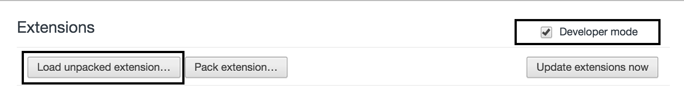

# myHEROsg-API-Extension
This extension helps you test myHEROsg algorithm API

## Downloading

> Go to [this page](https://github.com/DesperadoFlames/myHEROsg-API-Extension), and click "Clone or Download", and then "Download ZIP"
> 

> Unzip the downloaded file, and open [Chrome extensions](chrome://extensions/). Enable Developer Mode, and click "Load unpacked extension...", and navigate to the expanded folder, then click "Select".
> 

> You will see the extension loaded on the extension bar.
> 

## Usage

> Click the extension icon to launch it. Enter the symptoms from the upper box, click send, and you will receive the response in seconds, displayed in the lower box.
> 